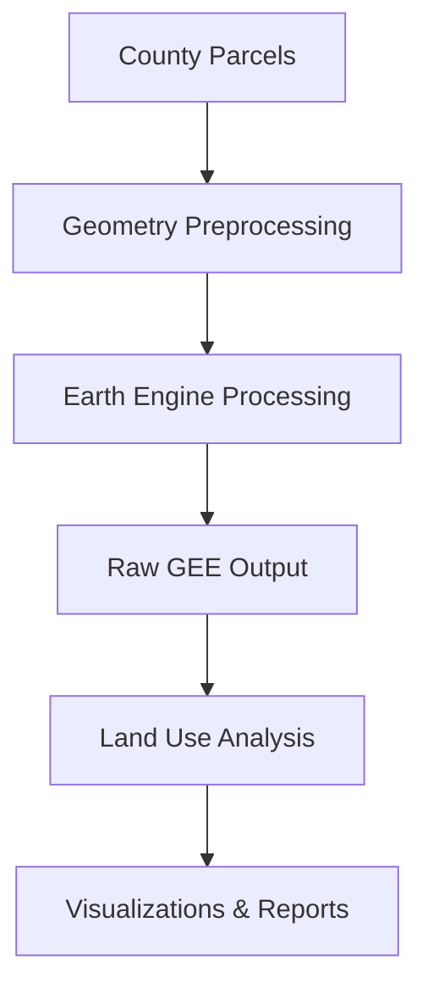
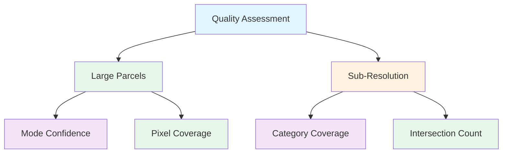

# GEE LCMS Analysis Pipeline

A comprehensive pipeline for analyzing land use changes using Google Earth Engine's Landscape Change Monitoring System (LCMS) dataset. This pipeline processes county-level parcel data to track and analyze land use changes from 1985 to 2023.

## Project Overview



### Core Components

1. **Parcel Processing** (`process_county_parcels_prod.py`)
   ```mermaid
   graph LR
       A[Input Parcels] --> B[Clean Properties]
       B --> C[Optimize Data Types]
       C --> D[Simplify Geometries]
       D --> E[EE Processing]
       E --> F[Output]

       style A fill:#e1f5fe
       style B fill:#e8f5e9
       style C fill:#fff3e0
       style D fill:#f3e5f5
       style E fill:#e8f5e9
       style F fill:#f3e5f5
   ```

2. **Land Use Analysis** (`analyze_land_use_changes_prod.py`)
   ```mermaid
   graph LR
       A[Raw GEE Data] --> B[Transition Matrices]
       A --> C[Temporal Trends]
       A --> D[Area Analysis]
       B & C & D --> E[Visualizations]
       E --> F[Reports]

       style A fill:#e1f5fe
       style B fill:#e8f5e9
       style C fill:#fff3e0
       style D fill:#f3e5f5
       style E fill:#e8f5e9
       style F fill:#f3e5f5
   ```

3. **Output Merging** (`merge_lcms_outputs_prod.py`)
   - Combines results from multiple processing runs
   - Generates consolidated reports
   - Validates data consistency

## Land-use Classifications

The pipeline analyzes four main land use categories:

| Code | Category    | Color    | Description                           |
|------|------------|----------|---------------------------------------|
| 1    | Agriculture| #ffd700  | Cropland and agricultural areas       |
| 2    | Developed  | #ff4444  | Urban and developed areas            |
| 3    | Forest     | #228b22  | Forest and woodland areas            |
| 6    | Pasture    | #deb887  | Rangeland and pasture areas          |

## Processing Rules

### Resolution-based Processing

1. **Large Parcels** (>900 m²)
   ```
   ┌────────────────┐
   │ LCMS Pixel     │
   │ (30m x 30m)    │
   │                │
   │    900 m²      │
   └────────────────┘
   ```
   - Use mode of land use classifications
   - Track pixel count for quality
   - Include dominant and secondary classes

2. **Sub-Resolution Parcels** (<900 m²)
   ```
   ┌────────────────┐
   │ LCMS Pixel     │
   │   ┌──┐         │
   │   │P │         │
   │   └──┘         │
   └────────────────┘
   ```
   - Area-weighted classification
   - Calculate percentage coverage
   - Track intersection metrics

### Quality Metrics



## Project Structure

```
gee-lcms/
├── scripts/
│   ├── process_county_parcels_prod.py
│   ├── analyze_land_use_changes_prod.py
│   ├── merge_lcms_outputs_prod.py
│   └── development/
│       └── [development scripts]
├── data/
│   └── ee_output/
│       └── raw_gee_output/
│           └── LCMS_[County]_Production/
└── docs/
    └── scaling_strategy.md
```

## Usage

1. Set up environment:
   ```bash
   export EE_PROJECT_ID="ee-chrismihiar"
   ```

2. Run the pipeline:
   ```bash
   python scripts/process_county_parcels_prod.py --county [COUNTY_NAME]
   python scripts/analyze_land_use_changes_prod.py --input [GEE_OUTPUT]
   ```

3. Check outputs:
   - Raw GEE results in `data/ee_output/raw_gee_output/`
   - Analysis reports in `[output_dir]/reports/`
   - Visualizations in `[output_dir]/plots/`

## Performance Features

- Memory-optimized for large datasets
- Parallel processing capabilities
- Chunked data processing
- Comprehensive error handling
- Detailed logging and progress tracking

## Testing

Run tests with:
```bash
./tests/run_area_test.sh your-ee-project-id
```

For detailed information about performance optimization and scaling strategies, please refer to `docs/scaling_strategy.md`. 