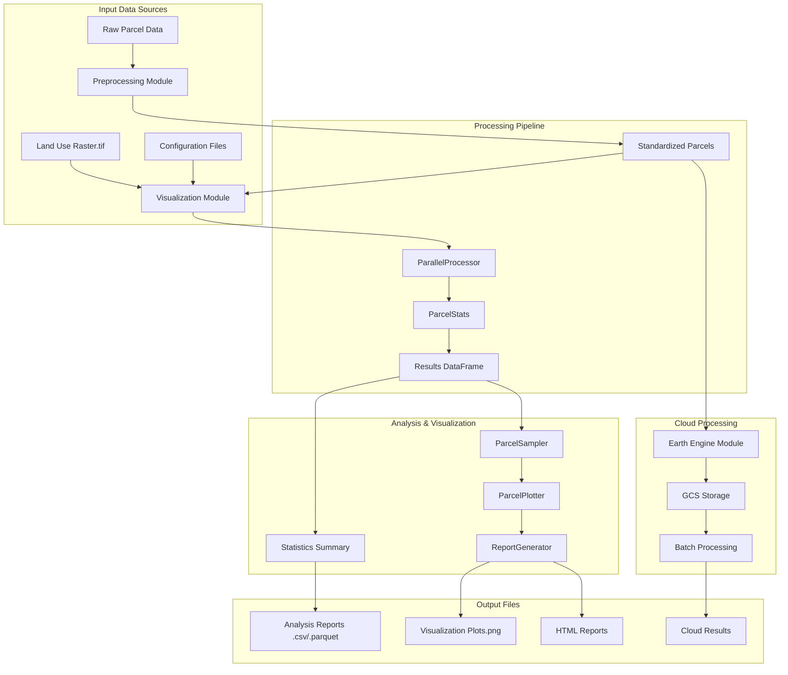

# ParcelPy

[](https://opensource.org/licenses/MIT)
[](https://www.python.org/downloads/)
[](https://github.com/your-username/parcelpy/issues)
[](CONTRIBUTING.md)

ParcelPy is a comprehensive geospatial analysis toolkit designed for land use analysis within parcels using LCMS (Land Change Monitoring, Assessment, and Projection) data. The project provides a complete pipeline from data preprocessing to analysis and visualization of parcel geometry data against land use raster data.

## Overview

ParcelPy is a modular toolkit that enables users to analyze land use composition of parcels using geospatial data. The system processes parcel geometry data against land use raster data to calculate statistics and generate visualizations. It features flexible configuration systems, parallel processing capabilities, and both local and cloud-based processing options.



## Project Architecture

ParcelPy follows a modular design with four specialized components:

### 1. **Visualization Module (`viz/`)**
The core analysis engine for land use composition analysis.

**Key Features:**
- Parallel processing of parcel data against LCMS raster data
- Statistical analysis of land use composition within parcels
- Automated visualization generation and reporting
- YAML-based configuration system
- Interactive mapping capabilities

**Main Components:**
- `main.py`: Pipeline orchestration with parallel processing
- `data_loader.py`: Handles parcel (Parquet) and raster (GeoTIFF) data loading
- `core/parcel_stats.py`: Pure functions for statistical calculations
- `visualization/`: Plotting, sampling, and report generation modules
- `cli.py`: Command-line interface

### 2. **Preprocessing Module (`preprocess/`)**
Data standardization and preparation pipeline.

**Features:**
- Field mapping and schema registry
- PID (Parcel ID) processing and validation
- Data transformation and standardization
- Orchestrated preprocessing workflows
- Quality assurance and reporting

### 3. **Earth Engine Module (`earthengine/`)**
Google Earth Engine integration for large-scale cloud processing.

**Features:**
- Batch processing of county parcel data
- Cloud-based computation using Google Earth Engine
- Google Cloud Storage integration
- Chunked processing for memory optimization
- Scalable processing for large datasets

### 4. **Partition Module (`partition/`)**
Data partitioning and geometry processing utilities.

**Features:**
- Spatial partitioning algorithms
- Geometry validation and repair
- Overlap detection and resolution
- Performance optimization tools

## Core Functionality

### Data Loading and Processing
- Loads parcel geometry data from Parquet files using GeoPandas
- Processes LCMS land use raster data using rioxarray and xarray
- Performs spatial analysis to determine land use composition within parcels
- Supports multiple coordinate reference systems with automatic reprojection

### Parallel Processing Engine
- Implements efficient parallel processing for handling large datasets
- Supports chunking of data to optimize memory usage
- Includes utilities for monitoring progress and handling errors
- Configurable worker processes and chunk sizes

### Statistical Analysis
- Calculates land use composition percentages for each parcel
- Computes summary statistics across the entire dataset
- Validates results with quality checks
- Supports custom land use classification schemes

### Visualization Components
- Generates plots showing land use composition within parcels
- Creates sample visualizations of representative parcels
- Produces summary reports and charts
- Interactive web-based mapping interface
- Customizable color schemes and styling

### Cloud Processing
- Google Earth Engine integration for large-scale analysis
- Batch processing capabilities for multiple counties/states
- Cloud storage integration (Google Cloud Storage)
- Scalable processing for continental-scale datasets

## Installation

### Prerequisites
- Python 3.8+
- uv package manager (recommended)
- Google Cloud SDK (for Earth Engine module)
- Earth Engine authentication (for cloud processing)

### Setup

```bash
# Clone the repository
git clone https://github.com/your-username/parcelpy.git
cd parcelpy

# Install uv if not already installed
curl -LsSf https://astral.sh/uv/install.sh | sh

# Set up virtual environment and install dependencies for visualization module
cd viz
uv venv
source .venv/bin/activate  # Linux/Mac
uv pip install -r requirements.txt

# Preprocessing module setup
cd ../preprocess
uv venv
source .venv/bin/activate
uv pip install -r requirements.txt

# Earth Engine module setup
cd ../earthengine
uv venv
source .venv/bin/activate
uv pip install -r requirements.txt
# Authenticate with Google Earth Engine
earthengine authenticate
```

## Usage

### Visualization Module (Primary Analysis)

#### Command Line Interface

```bash
# Navigate to viz directory
cd viz

# Process parcels and generate visualizations
python -m src.cli map data/parcels/ITAS_parcels_albers.parquet data/lcms/LCMS_CONUS_v2023-9_Land_Use_2023.tif --output-dir output/reports

# Create interactive web map
python -m src.cli interactive-map data/parcels/parcels.parquet output/reports/parcel_analysis_results.parquet --output-dir interactive_maps

# Generate visualizations from existing results
python -m src.visualization.visualize --results-file output/reports/parcel_analysis_results.parquet
```

#### Python API

```python
from viz.src.main import ParcelAnalysisPipeline

# Initialize the pipeline
pipeline = ParcelAnalysisPipeline(
    parcel_file="data/parcels/ITAS_parcels_albers.parquet",
    raster_file="data/lcms/LCMS_CONUS_v2023-9_Land_Use_2023.tif",
    output_dir="output/reports"
)

# Load data
pipeline.load_data()

# Process parcels
results = pipeline.process_parcels()

# Analyze results
summary = pipeline.analyze_results(results)

# Create visualizations
pipeline.create_visualizations(results)

# Save results
pipeline.save_results(results, summary)
```

### Preprocessing Module

```bash
# Navigate to preprocess directory
cd preprocess

# Standardize parcel data
python -m src.cli.standardize_parcel_data --input data/raw_parcels.csv --state NC --county CLAY --output output/
```

### Earth Engine Module

```bash
# Navigate to earthengine directory
cd earthengine

# Process single county
python ee_process_counties.py --state CA --county Alameda

# Process all counties in a state
python ee_process_counties.py --state CA --all-counties

# Start from specific county
python ee_process_counties.py --state CA --start-from Yolo --start-year 1990 --end-year 2022
```

## Configuration

Each module uses its own configuration system:

### Visualization Module (`viz/cfg/config.yml`)
- Land use visualization settings (colors and labels)
- Default file paths
- Processing parameters (workers, chunk size)
- Visualization settings (sample size, output resolution)

### Preprocessing Module
- Schema registry definitions
- Field mapping configurations
- Transformation rules

## Directory Structure

```
parcelpy/
├── viz/                        # Core visualization and analysis module
│   ├── cfg/                    # Configuration files
│   ├── data/                   # Sample data
│   ├── src/                    # Source code
│   │   ├── core/               # Core functionality
│   │   ├── parallel_processing/# Parallel processing utilities
│   │   ├── visualization/      # Visualization components
│   │   ├── interactive_mapping/# Interactive web mapping
│   │   ├── cli.py              # Command-line interface
│   │   ├── data_loader.py      # Data loading utilities
│   │   └── main.py             # Main pipeline implementation
│   ├── tests/                  # Test suite
│   └── requirements.txt        # Dependencies
├── preprocess/                 # Data preprocessing and standardization
│   ├── src/                    # Source code
│   │   ├── cli/                # Command-line tools
│   │   ├── data_loading/       # Data loading utilities
│   │   ├── field_mapping/      # Field mapping tools
│   │   ├── schema_registry/    # Schema definitions
│   │   └── orchestration/      # Processing orchestration
│   └── output/                 # Processed data output
├── earthengine/                # Google Earth Engine integration
│   ├── gee_examples/           # Example scripts
│   ├── logs/                   # Processing logs
│   └── ee_process_counties.py  # Main processing script
├── partition/                  # Data partitioning utilities
│   ├── tests/                  # Test suite
│   └── logs/                   # Processing logs
├── data/                       # Shared data directory
│   ├── nc/                     # North Carolina sample data
│   └── nc_counties/            # County-specific data
└── README.md                   # This file
```

## Dependencies

The project relies on several key Python libraries:

**Core Geospatial Stack:**
- geopandas, shapely, fiona, pyproj
- rasterio, rioxarray, xarray
- pandas, pyarrow

**Visualization:**
- matplotlib, folium (for interactive maps)

**Cloud Processing:**
- earthengine-api, geemap
- google-cloud-storage

**Development:**
- pytest (testing)
- jupyterlab (exploration)
- tqdm (progress bars)
- pyyaml (configuration)

## Workflow

The typical workflow involves:

1. **Data Preprocessing**: Standardize and validate parcel data using the preprocessing module
2. **Analysis**: Process parcels to calculate land use statistics using the visualization module
3. **Visualization**: Generate plots, reports, and interactive maps
4. **Cloud Processing**: Scale analysis using Earth Engine for large datasets
5. **Results**: Export processed data for further analysis

## Land Use Categories (LCMS)

The system supports the following LCMS land use categories:
- **Agriculture** (Code 1): Agricultural lands
- **Developed** (Code 2): Urban and developed areas  
- **Forest** (Code 3): Forested areas
- **Non-Forest Wetland** (Code 4): Wetland areas
- **Other** (Code 5): Other land use types
- **Rangeland or Pasture** (Code 6): Grazing and pasture lands
- **Non-Processing Area** (Code 7): Areas excluded from analysis

Each category is color-coded in visualizations and can be customized through configuration files.

## Use Cases

ParcelPy is designed for:

1. **Urban Planning**: Analyze land use composition within development parcels
2. **Environmental Research**: Study land use changes over time
3. **Agricultural Analysis**: Assess agricultural land distribution and changes
4. **Policy Analysis**: Generate reports for land use planning decisions
5. **Real Estate**: Evaluate property characteristics and surrounding land use
6. **Conservation**: Monitor protected areas and habitat fragmentation

## License

This project is licensed under the MIT License - see the LICENSE file for details. 