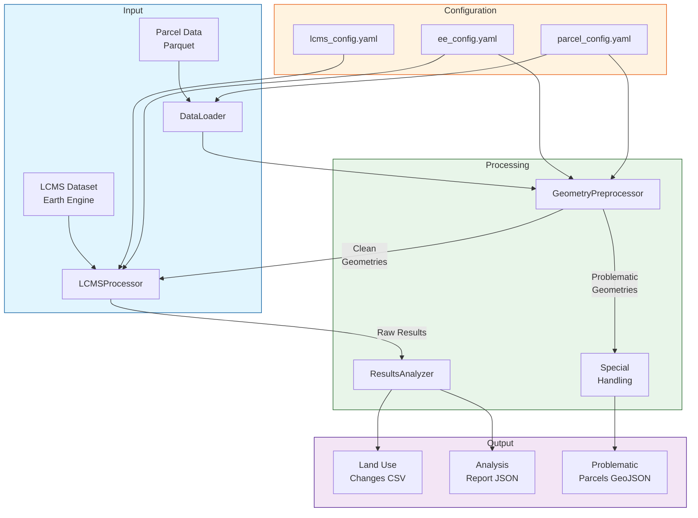

# GEE LCMS Analysis Pipeline

A pipeline for analyzing land use changes using Google Earth Engine's LCMS (Landscape Change Monitoring System) dataset.

## Land-use Change Analysis Rules

### Core Rules
1. Land-use change definition: A change in the land-use class of a parcel from one year to another.
2. Fixed total area: Total land area is constant across time periods.
3. Zero net change: The total net change in area sums to zero.
4. Complete proportions: The proportions of land-use classes in a spatial unit sum to 1.

### Resolution Rules
1. **Large Parcel Processing** (>900 m²)
   - LCMS Resolution: 30m x 30m (900 m²)
   - For parcels intersecting multiple pixels:
     * Use mode (most frequent value) of land use classifications
     * Track pixel count for quality assessment
     * Results include:
       - Dominant land use class (mode)
       - Total pixel count

2. **Sub-Resolution Handling** (<900 m²)
   - For parcels smaller than 900 m² (0.222 acres)
   - Area-weighted Classification Strategy:
     * Create area image using ee.Image.pixelArea()
     * Add land use as a band to area image
     * Group and sum areas by land use category
     * Calculate percentage of total area for each category
     * Assign the land use category with largest area coverage
     * Results include:
       - Dominant land use class
       - Area percentage of dominant class
       - Pixel count set to 1 (sub-resolution indicator)

### Quality Metrics
1. **Large Parcels**
   - Mode confidence (percentage of dominant class)
   - Pixel count and coverage
   - Secondary class percentages

2. **Sub-Resolution Parcels**
   - Dominant category coverage percentage
   - Secondary category coverage percentage
   - Number of unique intersecting categories

3. **Common Quality Flags**
   - LOW_CONFIDENCE: No category has >40% coverage
   - MIXED_USE: Multiple categories have similar coverage
   - COMPLEX_SHAPE: Many pixel intersections for size

## Pipeline Diagram


## Overview

This pipeline processes parcel data through Google Earth Engine to analyze land use changes over time. It includes robust geometry preprocessing, area calculations, and land use classification.

## Architecture

The pipeline consists of several key components:

1. **Geometry Preprocessing**
   - Validates and filters geometries before Earth Engine processing
   - Separates problematic geometries that need special handling
   - Tracks filtering statistics and issues
   - Ensures geometries meet Earth Engine requirements:
     - Valid geometry (no self-intersections)
     - Reasonable complexity (vertex count)
     - Appropriate size and structure

2. **Earth Engine Processing**
   - Handles clean geometries from the preprocessor
   - Projects geometries and calculates areas
   - Extracts land use classifications
   - Processes in configurable batch sizes

3. **Results Analysis**
   - Aggregates and validates results
   - Generates statistics and reports
   - Handles data export

## Performance Considerations

For detailed information about performance optimization, chunk size configuration, and scaling strategies, please refer to `docs/scaling_strategy.md`.

## Geometry Preprocessing

The pipeline uses a two-stage approach for handling geometries:

### Stage 1: Preprocessing
- Validates input geometries
- Filters out problematic cases:
  - Invalid geometries
  - Too many vertices (>1000 per polygon)
  - Too small (<1 m²)
  - Too many parts (>10 for MultiPolygons)
- Saves problematic geometries for separate handling
- Provides detailed statistics on filtering

### Stage 2: Earth Engine Processing
- Processes only clean, validated geometries
- Ensures reliable area calculations
- Maintains consistent results

## Configuration

Key configuration files:

- `config/ee_config.yaml`: Earth Engine settings
- `config/lcms_config.yaml`: LCMS dataset configuration
- `config/parcel_config.yaml`: Parcel processing parameters

## Usage

1. Set up environment:
   ```bash
   export EE_PROJECT_ID="ee-chrismihiar"
   ```

2. Run the pipeline:
   ```bash
   python src/analyze_land_use.py path/to/parcels.parquet
   ```

3. Check results:
   - Clean results in `outputs/land_use_changes.csv`
   - Problematic geometries in `outputs/problematic_parcels.geojson`
   - Analysis report in `outputs/analysis_report.json`

## Handling Problematic Geometries

Geometries filtered out during preprocessing may need special handling:

1. **Invalid Geometries**
   - Review and fix topology issues
   - Consider using `shapely.buffer(0)` for self-intersections

2. **Complex Geometries**
   - Simplify using Douglas-Peucker algorithm
   - Split into smaller parts

3. **Small Geometries**
   - Verify if they're actual parcels or artifacts
   - Consider merging with adjacent parcels

## Testing

Run tests with:
```bash
./tests/run_area_test.sh your-ee-project-id
```

Tests include:
- Area calculation validation
- Geometry preprocessing checks
- End-to-end pipeline testing 

## Output Format

### CSV Columns
- `parcel_id`: Unique identifier for each parcel
- `landuse_YYYY`: Land use classification for each year
- `pixel_count`: Number of LCMS pixels intersecting the parcel
- `sub_resolution_flag`: Boolean indicating if parcel is smaller than LCMS resolution
- `dominant_category_pct`: Percentage of parcel covered by assigned category
- `secondary_category_pct`: Percentage of parcel covered by second most common category
- `unique_classes`: Number of unique land use classes in intersecting pixels
- `quality_flags`: Flags indicating potential quality issues 