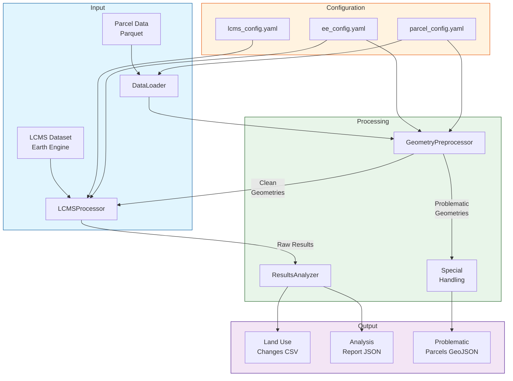

# GEE LCMS Analysis Pipeline

A pipeline for analyzing land use changes using Google Earth Engine's LCMS (Landscape Change Monitoring System) dataset.

## Land-use change logic rules

1. Land-use change definition: A change in the land-use class of a parcel from one year to another.
2. Fixed total area: Total land area is constant across time periods.
3. Zero net change: The total net change in area sums to zero.
4. Complete proportions: The proportions of land-use classes in a spatial unit sum to 1.

## Pipeline Diagram


## Overview

This pipeline processes parcel data through Google Earth Engine to analyze land use changes over time. It includes robust geometry preprocessing, area calculations, and land use classification.

## Architecture

The pipeline consists of several key components:

1. **Geometry Preprocessing**
   - Validates and filters geometries before Earth Engine processing
   - Separates problematic geometries that need special handling
   - Tracks filtering statistics and issues
   - Ensures geometries meet Earth Engine requirements:
     - Valid geometry (no self-intersections)
     - Reasonable complexity (vertex count)
     - Appropriate size and structure

2. **Earth Engine Processing**
   - Handles clean geometries from the preprocessor
   - Projects geometries and calculates areas
   - Extracts land use classifications
   - Processes in configurable batch sizes

3. **Results Analysis**
   - Aggregates and validates results
   - Generates statistics and reports
   - Handles data export

## Geometry Preprocessing

The pipeline uses a two-stage approach for handling geometries:

### Stage 1: Preprocessing
- Validates input geometries
- Filters out problematic cases:
  - Invalid geometries
  - Too many vertices (>1000 per polygon)
  - Too small (<1 m²)
  - Too many parts (>10 for MultiPolygons)
- Saves problematic geometries for separate handling
- Provides detailed statistics on filtering

### Stage 2: Earth Engine Processing
- Processes only clean, validated geometries
- Ensures reliable area calculations
- Maintains consistent results

## Configuration

Key configuration files:

- `config/ee_config.yaml`: Earth Engine settings
- `config/lcms_config.yaml`: LCMS dataset configuration
- `config/parcel_config.yaml`: Parcel processing parameters

## Usage

1. Set up environment:
   ```bash
   export EE_PROJECT_ID="your-project-id"
   ```

2. Run the pipeline:
   ```bash
   python src/analyze_land_use.py path/to/parcels.parquet
   ```

3. Check results:
   - Clean results in `outputs/land_use_changes.csv`
   - Problematic geometries in `outputs/problematic_parcels.geojson`
   - Analysis report in `outputs/analysis_report.json`

## Handling Problematic Geometries

Geometries filtered out during preprocessing may need special handling:

1. **Invalid Geometries**
   - Review and fix topology issues
   - Consider using `shapely.buffer(0)` for self-intersections

2. **Complex Geometries**
   - Simplify using Douglas-Peucker algorithm
   - Split into smaller parts

3. **Small Geometries**
   - Verify if they're actual parcels or artifacts
   - Consider merging with adjacent parcels

## Output File Size and Chunk Size Optimization

The pipeline processes data in chunks to handle Earth Engine's limitations. Based on empirical testing and Earth Engine constraints:

1. **Earth Engine Constraints**
   - Maximum payload size: 10MB for any single Earth Engine request
   - This limit applies to both input geometries and output results
   - Complex geometries consume more payload space than simple ones
   - Properties (attributes) also contribute to payload size

2. **File Size Patterns**
   - Each chunk of 1000 features produces a CSV file between 250KB-1.5MB
   - File size varies based on geometry complexity and property count
   - Average file size is ~600KB per 1000 features
   - Output file size ≈ 0.6-1.5x input geometry size due to added properties
≈
3. **Chunk Size Optimization**
   - Default chunk size: 1000 features
   - Rule of thumb: If input geometries for 1000 features > 5MB, reduce chunk size
   - Safe chunk sizes based on input geometry size:
     * Simple geometries (< 5KB each): 1000 features/chunk
     * Medium geometries (5-10KB each): 500-700 features/chunk
     * Complex geometries (> 10KB each): 200-400 features/chunk

4. **Performance Optimization**
   - Monitor Earth Engine task memory usage
   - If seeing "Payload size exceeded" errors:
     * First try reducing chunk size
     * If still failing, simplify geometries
   - Balance between:
     * Larger chunks = fewer API calls but higher memory usage
     * Smaller chunks = more API calls but lower memory usage

5. **Storage Planning**
   - Estimate output storage: ~0.6MB per 1000 features
   - Example: 100,000 features ≈ 60MB total output
   - Add 50% buffer for complex geometries
   - Plan storage capacity based on your input data size

## Testing

Run tests with:
```bash
./tests/run_area_test.sh your-ee-project-id
```

Tests include:
- Area calculation validation
- Geometry preprocessing checks
- End-to-end pipeline testing 