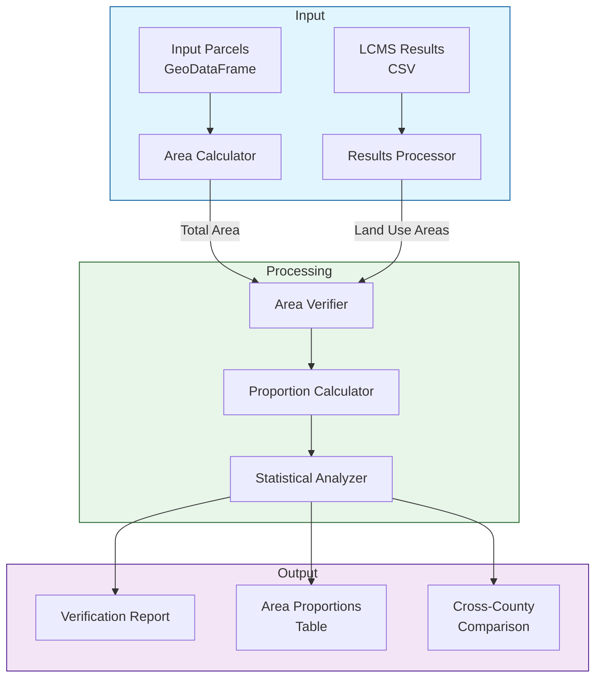

# Land Area Verification Module

## Overview
The Land Area Verification module ensures the consistency of land use area calculations across the LCMS analysis pipeline. It verifies that the total area of all land uses matches the total area of input parcels, and tracks the proportion of each land use type across different years.

## Purpose
- Validate area calculations from LCMS analysis
- Track land use proportions over time
- Identify potential discrepancies in area calculations
- Enable cross-county comparisons of land use distributions

## Architecture



## Components

### 1. Area Calculator
- Calculates total land area from input parcels
- Projects geometries to appropriate CRS for accurate area calculation
- Handles geometry validation and error reporting
- Outputs total area in hectares

### 2. Results Processor
- Loads and processes LCMS analysis results
- Aggregates areas by land use type and year
- Validates data completeness and consistency
- Handles missing or invalid data

### 3. Area Verifier
- Compares total areas between input and results
- Calculates area discrepancies
- Sets tolerance thresholds for acceptable differences
- Flags significant discrepancies for review

### 4. Proportion Calculator
- Calculates proportion of each land use type
- Tracks changes in proportions over time
- Generates summary statistics
- Produces standardized comparison metrics

### 5. Statistical Analyzer
- Performs statistical analysis on proportions
- Calculates variation metrics
- Generates cross-county comparisons
- Identifies significant trends or anomalies

## Output Format

### Verification Report
```json
{
    "metadata": {
        "county": "Itasca",
        "analysis_date": "2024-03-20",
        "input_crs": "EPSG:26915",
        "area_unit": "hectares"
    },
    "area_verification": {
        "total_input_area": 100000.0,
        "total_lcms_area": 99950.0,
        "area_difference": 50.0,
        "difference_percentage": 0.05,
        "within_tolerance": true
    },
    "warnings": []
}
```

### Area Proportions Table
```
| Land Use Type | 2013 Area (ha) | 2013 Proportion | 2022 Area (ha) | 2022 Proportion | Change |
|--------------|----------------|-----------------|----------------|-----------------|---------|
| Forest       | 75000.0       | 0.75           | 74000.0       | 0.74           | -0.01   |
| Agriculture  | 15000.0       | 0.15           | 15500.0       | 0.155          | +0.005  |
| Urban        | 5000.0        | 0.05           | 5500.0        | 0.055          | +0.005  |
| Water        | 5000.0        | 0.05           | 5000.0        | 0.05           | 0.0     |
```

### Cross-County Comparison
```
| County    | Forest % | Agriculture % | Urban % | Water % | Stability Index |
|-----------|----------|---------------|---------|---------|-----------------|
| Itasca    | 74.0     | 15.5         | 5.5     | 5.0     | 0.98           |
| St. Louis | 78.0     | 12.0         | 5.0     | 5.0     | 0.97           |
```

## Usage

1. Run independently:
```bash
python src/verification/verify_areas.py \
    --parcels path/to/parcels.parquet \
    --results path/to/results.csv \
    --output path/to/output/dir
```

2. Import as module:
```python
from src.verification import AreaVerifier

verifier = AreaVerifier(tolerance_pct=0.1)
report = verifier.verify(
    parcels_path="path/to/parcels.parquet",
    results_path="path/to/results.csv"
)
```

## Configuration

The module uses a dedicated configuration file: `config/verification_config.yaml`

```yaml
verification:
  area_tolerance_pct: 0.1
  min_proportion_threshold: 0.001
  crs: "EPSG:26915"
  
output:
  report_format: "json"
  include_warnings: true
  save_intermediates: false
```

## Dependencies
- geopandas
- pandas
- numpy
- pyyaml
- shapely

## Integration
While this module operates independently, it can be integrated into the main pipeline as a validation step:

```python
from src.verification import verify_results

def run_pipeline():
    # ... existing pipeline code ...
    
    # Add verification step
    verification_report = verify_results(
        parcels=input_parcels,
        results=lcms_results
    )
    
    if not verification_report['area_verification']['within_tolerance']:
        logger.warning("Area verification failed!")
        # Handle verification failure
``` 