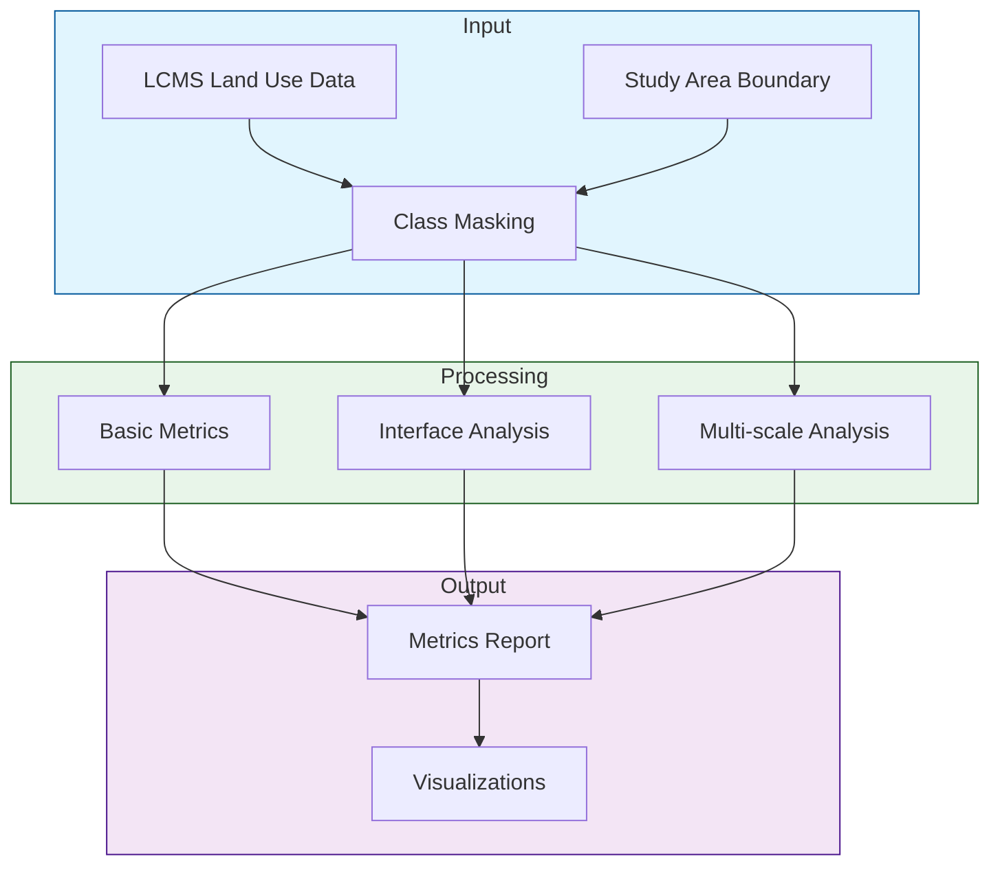

# Urban Sprawl Analysis Module Design (Phase 1)

## Overview

This document outlines the initial phase of the urban sprawl analysis module, focusing on basic spatial metrics using LCMS land use data. The current implementation uses a simplified three-class system and focuses on Itasca County, Minnesota as a test area.

## Simplified Land Use Classification

We collapse the LCMS classes into three main groups:
1. **Urban/Developed** (LCMS class 2)
2. **Forest/Wetland** (LCMS classes 3, 4)
3. **Agriculture** (LCMS classes 1, 6)

Other classes (5, 7) are masked out for initial analysis.

## Core Metrics

### 1. Basic Urban Metrics
- Urban area fraction
- Total urban area (hectares)
- Basic spatial distribution

### 2. Interface Metrics
- Urban-Forest/Wetland interface length (km)
- Urban-Agriculture interface length (km)

### 3. Multi-scale Density
Analysis at three scales:
- Local (90m - 3x3 LCMS pixels)
- Neighborhood (300m)
- District (900m)

## Implementation



## Visualization Types

1. **Basic Maps**
   ```mermaid
   graph LR
       A[Land Use Classes] --> B[Classified Map]
       style A fill:#f9f,stroke:#333
       style B fill:#bbf,stroke:#333
   ```

2. **Interface Analysis**
   ```mermaid
   graph TD
       A[Urban Edges] --> B[Interface Map]
       B --> C[Edge Statistics]
       style A fill:#f96,stroke:#333
       style B fill:#9c6,stroke:#333
       style C fill:#69c,stroke:#333
   ```

3. **Density Surfaces**
   ```mermaid
   graph LR
       A[Urban Mask] --> B[Density Surface]
       B --> C[Scale Comparison]
       style A fill:#f9f,stroke:#333
       style B fill:#bbf,stroke:#333
       style C fill:#69c,stroke:#333
   ```

## Test Area: Itasca County, MN

- Coordinates: [-94.5, 47.0] to [-93.0, 48.0]
- Area: Approximately 7,000 km²
- Mixed land use patterns
- Significant forest cover
- Scattered urban development

## Usage Example

```python
from src.core.urban_sprawl import UrbanSprawlAnalyzer
from src.visualization import plot_urban_metrics

# Initialize analyzer
analyzer = UrbanSprawlAnalyzer()

# Run analysis for test area
metrics = analyzer.analyze_year(2020)

# Generate visualizations
plot_urban_metrics(metrics, output_path='outputs/itasca_2020')
```

## Output Format

```yaml
metrics:
  urban:
    urban_fraction: 0.05  # Example value
    urban_area_ha: 3500   # Example value
  
  interfaces:
    forest_wetland_interface_km: 250  # Example value
    agriculture_interface_km: 100      # Example value
  
  multi_scale:
    local:
      mean_density: 0.12
      std_dev: 0.08
    neighborhood:
      mean_density: 0.15
      std_dev: 0.10
    district:
      mean_density: 0.18
      std_dev: 0.12
```

## Current Limitations

1. Binary urban/non-urban classification
2. No intensity differentiation
3. Limited to single-year analysis
4. Basic edge detection

## Next Steps

1. Validate metrics against known urban patterns
2. Add temporal change analysis
3. Incorporate development intensity
4. Add pattern metrics (fragmentation, connectivity)